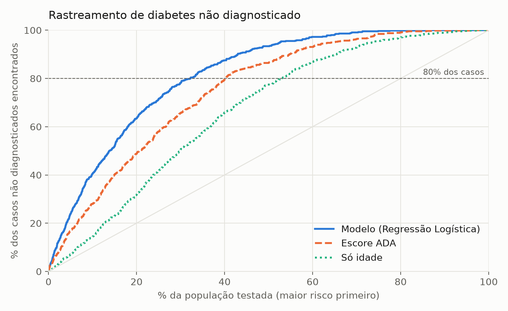
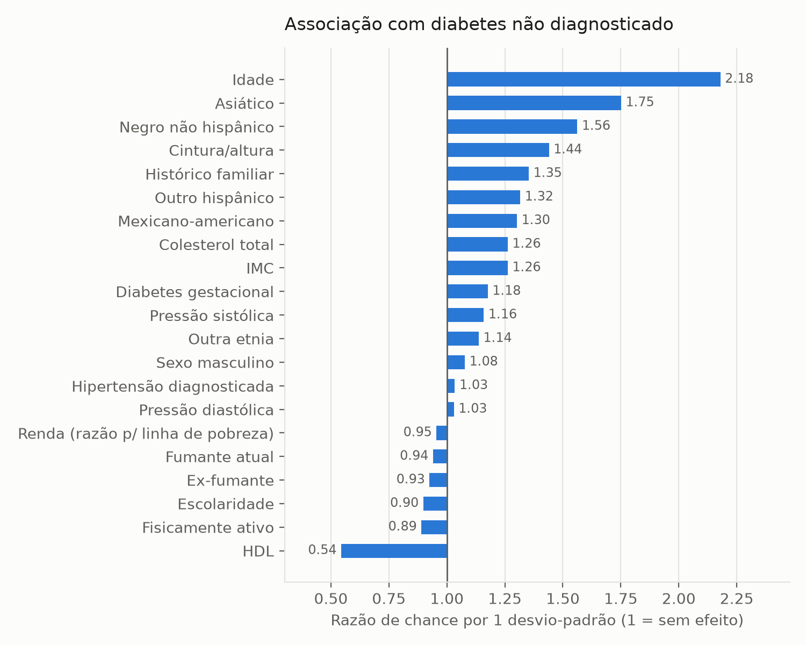

# Estudo complementar: rastreamento de diabetes não diagnosticado (NHANES 2011-2018)

*Gerado por `estudo_nhanes_rastreamento.py` em 01/10/2026.*

## Pergunta

Entre adultos **sem diagnóstico de diabetes**, é possível identificar quem tem diabetes e não sabe usando apenas
informações de uma consulta comum, sem exame de glicose? E o modelo é melhor que o escore de risco da American
Diabetes Association (ADA), usado na prática?

## Dados e desfecho

- NHANES (CDC, EUA), ciclos 2011-2012, 2013-2014, 2015-2016, 2017-2018: inquérito com exame físico e de sangue.
- Adultos ≥ 20 anos, não grávidas, com HbA1c medida e **sem** diagnóstico prévio de diabetes: **17,306 pessoas**.
- Desfecho: **HbA1c ≥ 6,5%** (critério diagnóstico). Casos: **648 (3.7% da amostra; 2.4%
  com os pesos amostrais, estimativa para a população adulta dos EUA sem diagnóstico)**.
- HbA1c e glicemia **não** entram no modelo, pois definem o desfecho.

## Método (definido antes de rodar)

- 21 variáveis fixadas a priori: idade, sexo, etnia, IMC, cintura/altura, pressão sistólica e diastólica,
  colesterol, HDL, hipertensão diagnosticada, histórico familiar, atividade física, tabagismo, escolaridade, renda e
  diabetes gestacional. Ausentes imputados pela mediana dentro de cada partição de treino.
- Regressão Logística, XGBoost e Random Forest em **validação cruzada aninhada** (5 partes × 3 repetições);
  hiperparâmetros escolhidos só com os dados de treino de cada partição.
- Escolha: maior AUC média; um modelo mais simples a menos de 1 erro-padrão do melhor é preferido.
- Referências nas mesmas pessoas: **escore ADA** (7 perguntas: idade, sexo, diabetes gestacional, histórico familiar,
  hipertensão, atividade física, IMC; alto risco = escore ≥ 5) e ordenação só por idade.

## Resultados

| Modelo | AUC | AUC-PR | Brier | Testar p/ achar 80% dos casos | Casos achados testando o mesmo nº que o ADA ≥ 5 |
|---|---|---|---|---|---|
| Regressão Logística | 0.827 ± 0.018 | 0.148 | 0.034 | 31.2% | 88.9% |
| XGBoost | 0.820 ± 0.018 | 0.148 | 0.034 | 33.6% | 87.7% |
| Random Forest | 0.815 ± 0.017 | 0.133 | 0.034 | 33.2% | 87.8% |
| Escore ADA (referência) | 0.762 | — | — | 40.4% | 81.9% (testando 41.5%) |
| Só idade (referência) | 0.673 | — | — | 52.9% | — |

AUC-PR do acaso = prevalência (0.037). Modelo escolhido: **Regressão Logística**.
Diferença de AUC em relação ao escore ADA nas mesmas partições: **+0.065 ± 0.018**.

## Associação de cada variável (Regressão Logística)

Razão de chance por 1 desvio-padrão da variável (> 1 aumenta o risco; < 1 reduz), ajustada pelas demais.

| Variável | Razão de chance | Ausentes |
|---|---|---|
| Idade | 2.18 | 0.0% |
| HDL | 0.54 | 1.4% |
| Asiático | 1.75 | 0.0% |
| Negro não hispânico | 1.56 | 0.0% |
| Cintura/altura | 1.44 | 4.9% |
| Histórico familiar | 1.35 | 1.8% |
| Outro hispânico | 1.32 | 0.0% |
| Mexicano-americano | 1.30 | 0.0% |
| IMC | 1.26 | 1.1% |
| Colesterol total | 1.26 | 1.4% |
| Diabetes gestacional | 1.18 | 13.9% |
| Pressão sistólica | 1.16 | 3.7% |
| Outra etnia | 1.14 | 0.0% |
| Fisicamente ativo | 0.89 | 0.0% |
| Escolaridade | 0.90 | 0.1% |
| Ex-fumante | 0.93 | 0.1% |
| Sexo masculino | 1.08 | 0.0% |
| Fumante atual | 0.94 | 0.1% |
| Renda (razão p/ linha de pobreza) | 0.95 | 9.5% |
| Hipertensão diagnosticada | 1.03 | 0.1% |
| Pressão diastólica | 1.03 | 3.7% |

## Limitações

- Diagnóstico por **uma única** medida de HbA1c (na prática clínica, confirma-se com um segundo exame).
- Modelagem sem os pesos amostrais (a prevalência ponderada é informada à parte); dados dos EUA, sem validação
  externa em população brasileira.
- A pergunta é diferente da do modelo clínico do app (Pima): aqui não se usa glicose, e a prevalência é muito menor,
  por isso F1 e precisão não são comparáveis entre os dois.
