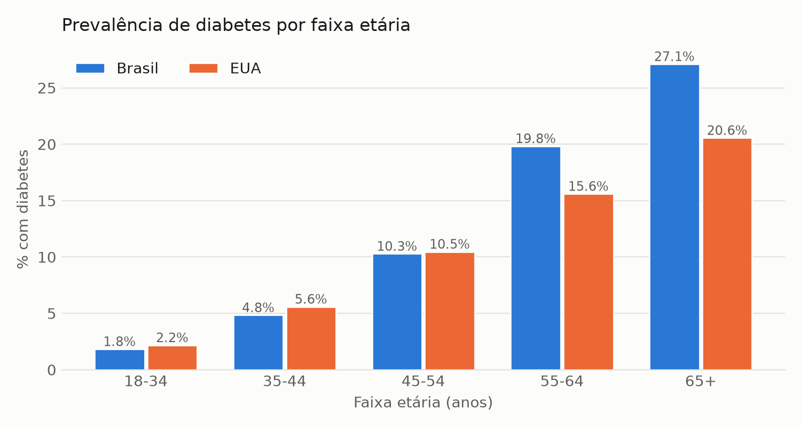
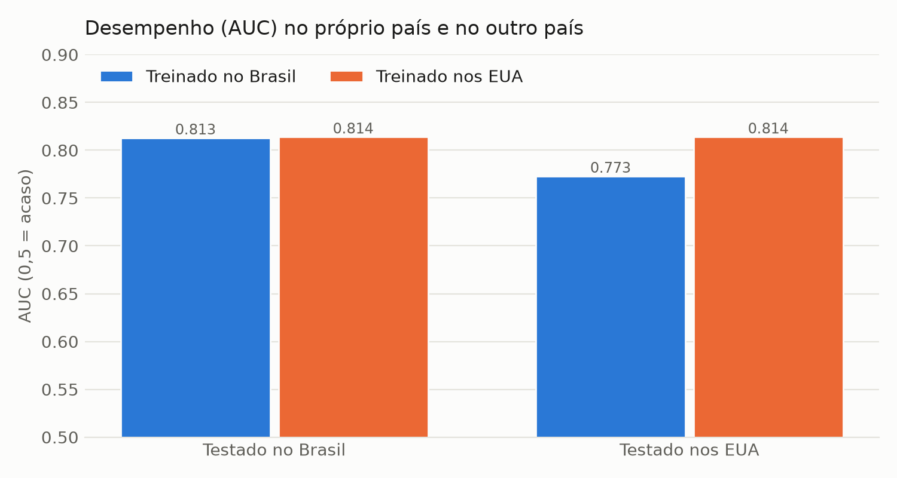
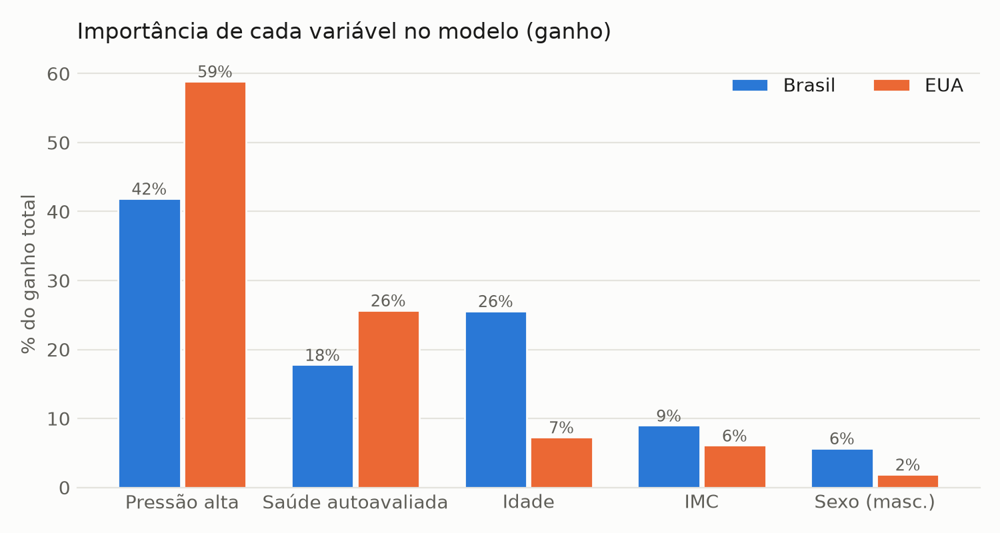

# Validação Cross-Cultural: Brasil (VIGITEL 2023) x EUA (BRFSS 2015)

*Gerado por `validacao_cross_cultural.py` em 01/10/2026.*

## 1. Dados e harmonização

| | Brasil | EUA |
|---|---|---|
| Pesquisa | VIGITEL 2023 (telefone) | BRFSS 2015 (telefone) |
| Registros válidos | 19,919 | 253,680 |
| Diabetes (diagnóstico autorreferido) | 12.6% na amostra, **10.1% ponderada** | 13.9% |

As variáveis do VIGITEL foram conferidas no dicionário oficial. Para comparar os países, os modelos usam
apenas as variáveis com **definição equivalente** nas duas pesquisas:

| Variável | VIGITEL | BRFSS |
|---|---|---|
| Idade | `q6` (anos), convertida para as 13 faixas do BRFSS | faixa etária (1 = 18-24 ... 13 = 80+) |
| Sexo | `q7` | `Sex` |
| IMC | `imc` | `BMI` |
| Pressão alta | `q75` (diagnóstico médico) | `HighBP` (diagnóstico médico) |
| Saúde autoavaliada | `q74` (muito bom ... muito ruim) | `GenHlth` (excelente ... ruim) |

**Ficaram de fora dos modelos (definições diferentes):**
- *Colesterol alto*: o VIGITEL não pergunta sobre o diagnóstico (só se fez o exame).
- *Fumante*: BRFSS = já fumou 100 cigarros na vida; VIGITEL = fuma atualmente.
- *Atividade física*: BRFSS = qualquer atividade no último mês; VIGITEL = ≥ 150 min/semana no lazer.
- *Frutas*: BRFSS = ≥ 1 vez/dia; VIGITEL = ≥ 5 dias/semana.

## 2. Perfil das populações

| Indicador | Brasil | EUA |
|---|---|---|
| IMC médio | 27.0 | 28.4 |
| Obesidade (IMC ≥ 30) | 23.9% | 34.6% |
| Pressão alta | 33.3% (ponderada: 27.3%) | 42.9% |
| Saúde ruim/muito ruim | 6.0% | 17.2% |
| Fumante* | 8.2% | 44.3% |
| Atividade física* | 41.5% | 75.7% |
| Frutas* | 60.8% | 63.4% |

\* Definições diferentes entre as pesquisas (ver seção 1): **não comparar diretamente**.

**Prevalência por faixa etária**

| Faixa | Diabetes Brasil | Diabetes EUA | % da amostra Brasil | % da amostra EUA |
|---|---|---|---|---|
| 18-34 | 1.8% | 2.2% | 23.5% | 9.6% |
| 35-44 | 4.8% | 5.6% | 19.3% | 11.8% |
| 45-54 | 10.3% | 10.5% | 18.2% | 18.2% |
| 55-64 | 19.8% | 15.6% | 16.9% | 25.3% |
| 65+ | 27.1% | 20.6% | 22.1% | 35.1% |

A diferença de prevalência bruta é estatisticamente significativa (qui-quadrado, p = 1.2e-07), mas as
amostras têm composição etária diferente. Padronizando o Brasil pela distribuição etária dos EUA, a
prevalência brasileira fica em **17.1%** (EUA: 13.9%).

## 3. Modelos e transferência entre países

Mesmo pipeline nos dois países: XGBoost, divisão 60/20/20 estratificada, limiar de decisão escolhido no
conjunto de validação (maior F1) e métricas calculadas no conjunto de teste, que o modelo nunca viu.

| Treinado em | Testado em | AUC | F1 | Precisão | Recall |
|---|---|---|---|---|---|
| Brasil | Brasil | 0.813 | 0.419 | 29.8% | 70.5% |
| EUA | EUA | 0.814 | 0.449 | 35.2% | 61.8% |
| EUA | Brasil | 0.814 | 0.372 | 39.3% | 35.3% |
| Brasil | EUA | 0.773 | 0.378 | 24.7% | 80.9% |

A **AUC** não depende do limiar e é a melhor métrica para comparar a capacidade de ordenar o risco entre
países. F1, precisão e recall dependem do limiar e da prevalência de cada população.

## 4. Importância das variáveis

| Variável | Brasil | EUA |
|---|---|---|
| Pressão alta | 41.9% | 58.9% |
| Saúde autoavaliada | 17.8% | 25.7% |
| Idade | 25.6% | 7.3% |
| IMC | 9.0% | 6.1% |
| Sexo (masc.) | 5.7% | 1.9% |

## 5. Limitações

- Pesquisas de anos diferentes (2015 x 2023) e diabetes **autorreferido**, que subestima casos não diagnosticados.
- A escala de saúde autoavaliada tem âncoras diferentes nas duas pesquisas (ex.: "regular" x "good").
- O conjunto BRFSS usado é a versão limpa do Kaggle, sem pesos amostrais; as comparações com o Brasil
  usam a amostra sem ponderação, exceto onde indicado.
- Variáveis importantes nos EUA (colesterol) não puderam ser usadas por não existirem no VIGITEL.
